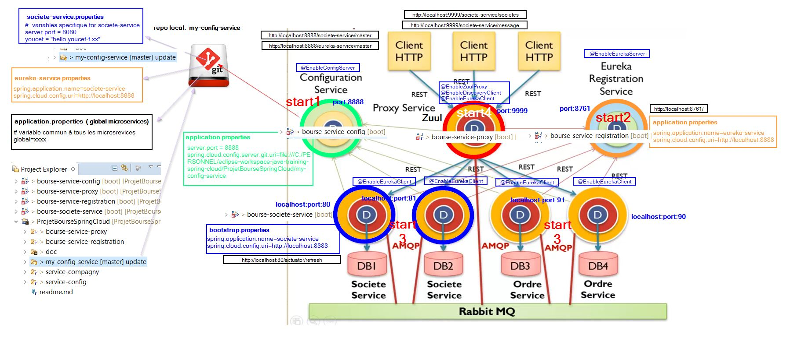
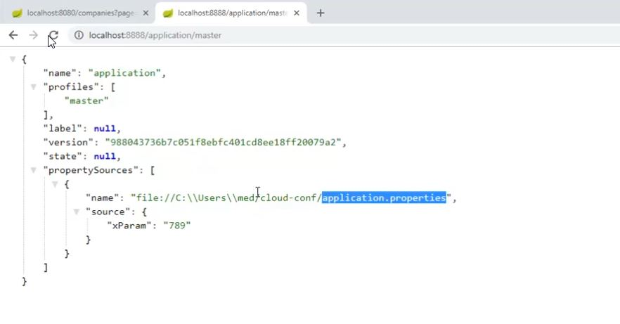

# micro service avec Spring Cloud


Apres git clone de ce projet .  Il faudra initialiser le repertoire git local **my-config-service**


Dans ce projet nous gerons deux microservices : GestionDesEntreprise cotés en bourse et gestionDesActions de ces entreprises.


**Ici Seule le microserice societe-service est creer.**

## diagramme de classe


## Architecture microservice societe service



## projet spring cloud  "Société-Service"


Relire le ficheir application.properties distant
````shell script
λ curl -H "Content-Type: application/json"  --request POST --data {} http://localhost:8080/actuator/refresh
["youcef"]
````


## projet spring "service config"
le repertoire **mt-config-service** contient la configuration des microservices


### initialisation d'un repo local git

`````shell script
my-config-service>git init
my-config-service> git add A .
my-config-service>git commit -m "add ."
[master (root-commit) 6b2b99a] add .
 1 file changed, 1 insertion(+)
 create mode 100644 application.properties
`````

### configuration des composant

Configuration gloable


Configuration eureka-service  


Configuration societe-service


 ### modififcation du fichier de configuration du microservice sur le repo.
 Il faut rafraichir le micro service pour lui notifier de relire la configuration nouvelle modifier en lui envoyant un request **post**


## Gateway Zuul.


 ## Eureka server ( annuaire d'enregistrement des micro serivces)
 


 

 ## Links

 ### proxy Zuul service
[http://localhost:9999/societe-service/societes](http://localhost:9999/societe-service/societes)
 [http://localhost:9999/societe-service/message](http://localhost:9999/societe-service/message)

#### eureka enregistrement service
http://localhost:8761/

 ### Server config service
 [config societe-service: http://localhost:8888/societe-service/master](http://localhost:8888/societe-service/master)  
 [config eureka-service: http://localhost:8888/eureka-service/master](http://localhost:8888/eureka-service/master)  
 [config global services: http://localhost:8888/application/master](http://localhost:8888/application/master)  


 #### microService Societe
 [http://localhost:80/societes](http://localhost:80/societes)
 [http://localhost:80/actuator/refresh](http://localhost:80/actuator/refresh)


